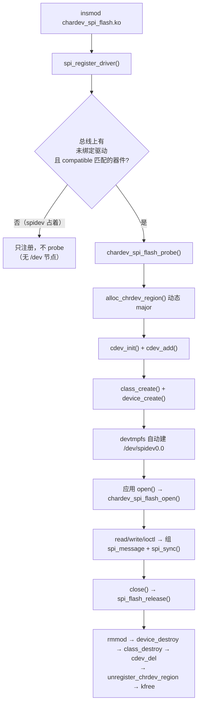

# chardev_spi_flash 设计文档（SPI 版字符驱动标准结构）

> 目标：把 [`chardev_i2c_tmp105`](../i2c-tmp105/设计文档.md) 那套"标准字符设备驱动"结构
> **原样搬到 SPI 总线上**，并且对外沿用**标准 spidev ABI**，
> 让 libobject 的用户态 Spi HAL / [`test_spi.c`](../../../../libobject/tests/board/test_spi.c:1)
> 一行不改就能跑在本驱动上。
>
> 代码：[`drivers/chardev/spi-flash/chardev_spi_flash.c`](../../../drivers/chardev/spi-flash/chardev_spi_flash.c)
> · 用户态验证程序：[`tests/chardev/spi-flash/spidev_test.c`](../../../tests/chardev/spi-flash/spidev_test.c)
> · 手动命令：[手动测试指南](手动测试指南.md)
> · 一键验收：[`tests/chardev/spi-flash/verify_qemu.sh`](../../../tests/chardev/spi-flash/verify_qemu.sh)

---

## 1. 范围

| 做 | 不做 |
|---|---|
| 字符设备标准骨架：设备号 / `cdev` / `class`+`device` / `file_operations` / ioctl / 错误回滚 | 不解析 SPI Flash 协议（不实现 m25p80/mtd：那是 `drivers/mtd` 的活） |
| 通过 `spi_driver` 绑定 SPI 器件（设备树自动 probe），用 `spi_sync()` 发 `spi_message` | 不驱动 SPI 控制器本身（PL022 由内核 `spi-pl022` 负责） |
| 对外 = **标准 spidev ABI**：`/dev/spidevB.C` + `SPI_IOC_*` | 不加私有 ioctl（规范 §3：对外 ABI 只用标准子系统） |
| 与内核 spidev **逐字节等价**（同 ABI、同语义），可互换 | 不做多实例 / DMA / `compat_ioctl`（列为 §9 扩展点） |

和 i2c 版的**唯一关键差异**（下面 §4 详述）：i2c 版可以"只借适配器、不注册 client"从而与 hwmon 驱动共存；
SPI 没有"适配器级裸传输 API"（`spi_sync()` 必须作用在 `spi_device` 上），所以本驱动**必须绑定器件**，
于是与内核 spidev 呈 **1:1 互斥**关系。

---

## 2. 字符驱动的标准结构（代码里的 ①~⑩）

| # | 要素 | 代码位置 | 与 i2c 版的差异 |
|---|---|---|---|
| ① | **设备发现** | [`chardev_spi_flash_of_match`](../../../drivers/chardev/spi-flash/chardev_spi_flash.c:508) + `spi_register_driver()` | i2c 版用模块参数 `bus/addr`（自己找适配器）；SPI 走**设备树自动匹配**（`compatible = "rohm,dh2228fv"`） |
| ② | **设备号** | [`alloc_chrdev_region()`](../../../drivers/chardev/spi-flash/chardev_spi_flash.c:541) | 一样（动态 major） |
| ③ | **`struct cdev`** | [`cdev_add()`](../../../drivers/chardev/spi-flash/chardev_spi_flash.c:550) | 一样 |
| ④ | **class + device** | [`class_create()`](../../../drivers/chardev/spi-flash/chardev_spi_flash.c:561) / [`device_create()`](../../../drivers/chardev/spi-flash/chardev_spi_flash.c:568) | 节点名 `spidev%d.%d`（**spidev ABI**，不是自定义名） |
| ⑤ | **file_operations** | [`chardev_spi_flash_fops`](../../../drivers/chardev/spi-flash/chardev_spi_flash.c:490) | 多一个：`llseek = no_llseek`（传输端点没有文件偏移语义） |
| ⑥ | **`file->private_data`** | [`chardev_spi_flash_open()`](../../../drivers/chardev/spi-flash/chardev_spi_flash.c:115) | 一样 |
| ⑦ | **内核↔用户态搬数据** | [`read()`](../../../drivers/chardev/spi-flash/chardev_spi_flash.c:146) / [`write()`](../../../drivers/chardev/spi-flash/chardev_spi_flash.c:184) | 语义不同：这里是**裸 SPI 半双工收发**（spidev 语义），不是"文本温度" |
| ⑧ | **ioctl** | [`chardev_spi_flash_ioctl()`](../../../drivers/chardev/spi-flash/chardev_spi_flash.c:333) | 命令号来自 `<linux/spi/spidev.h>`（UAPI），是标准 ABI 而非私有命令 |
| ⑨ | **并发保护** | `struct mutex lock` | i2c 版只锁"寄存器访问"；这里锁住"**改配置 + 传输**"（`spi_setup()` 与 `spi_sync()` 不能相互穿插） |
| ⑩ | **probe/remove 与回滚** | [`chardev_spi_flash_probe()`](../../../drivers/chardev/spi-flash/chardev_spi_flash.c:518) / [`chardev_spi_flash_remove()`](../../../drivers/chardev/spi-flash/chardev_spi_flash.c:601) | 生命周期由 SPI 总线驱动：**不写 `module_init` 里的注册逻辑**，只 `spi_register_driver()` |

### 2.1 生命周期



---

## 3. `/dev/spidevB.C` 的 ABI（= 标准 spidev）

命令号、方向、参数类型都来自内核 UAPI 头 `<linux/spi/spidev.h>`，**本驱动没有私有命令**。

| 命令 | 方向 | 参数 | 语义 |
|---|---|---|---|
| `SPI_IOC_WR_MODE` / `RD_MODE` | 写/读 | `u8` | SPI 模式（`SPI_MODE_0..3` + `SPI_CS_HIGH/LSB_FIRST/3WIRE/LOOP/NO_CS/READY`） |
| `SPI_IOC_WR_MODE32` / `RD_MODE32` | 写/读 | `u32` | 同上，32 位形式（支持 `SPI_TX_DUAL/QUAD`、`SPI_RX_DUAL/QUAD`） |
| `SPI_IOC_WR_MAX_SPEED_HZ` / `RD_MAX_SPEED_HZ` | 写/读 | `u32` | 传输默认速率（写时内部会 `spi_setup()`，再还原 `spi->max_speed_hz`） |
| `SPI_IOC_WR_BITS_PER_WORD` / `RD_BITS_PER_WORD` | 写/读 | `u8` | 字长 |
| `SPI_IOC_WR_LSB_FIRST` / `RD_LSB_FIRST` | 写/读 | `u8` | 位序 |
| `SPI_IOC_MESSAGE(N)` | 写 | `struct spi_ioc_transfer[N]` | 一次提交 N 段，**同一条 `spi_message`（一段 CS 有效窗口）** |

`read()` / `write()`：半双工，返回实际传输字节数（与 spidev 一致）。

### 3.1 `SPI_IOC_MESSAGE(N)` 的数据流

```text
用户态 struct spi_ioc_transfer[N]
   │  memdup_user（整体拷入）
   ▼
内核 struct spi_transfer[N] + 每段缓冲（tx: memdup_user / rx: kzalloc）
   │  spi_message_add_tail × N → spi_message_init
   ▼
spi_sync(spi, &msg)  ← 这一段是唯一碰总线的地方（⑨ 加锁）
   │  rx 缓冲 copy_to_user 回用户态
   ▼
返回总字节数（成功）或负 errno
```

### 3.2 错误码约定（实测）

| 场景 | 返回 | errno |
|---|---|---|
| 命令 magic 不对 / 命令号未知 | `-ENOTTY` | `ENOTTY`（25） |
| ioctl 指针非法（`access_ok` 失败） | `-EFAULT` | `EFAULT`（14） |
| `WR_MODE`/`WR_MODE32` 含 `SPI_MODE_MASK` 之外的位 | `-EINVAL` | `EINVAL`（22） |
| `WR_MAX_SPEED_HZ(0)`、消息段数 0 | `-EINVAL` | `EINVAL` |
| 命令号 0（`SPI_IOC_MESSAGE`）但 `_IOC_SIZE` 不是 `struct spi_ioc_transfer` 整数倍 | `-EINVAL` | `EINVAL` |
| 单段长度 > 4096（`SPI_FLASH_BUF_MAX`）或段数 > 16 | `-EMSGSIZE` / `-EINVAL` | `EMSGSIZE` / `EINVAL` |

---

## 4. 与内核自带 spidev 的关系（本驱动最需要讲清的一点）

| | 内核 `spidev`（`CONFIG_SPI_SPIDEV=y`） | 本驱动 `chardev_spi_flash` |
|---|---|---|
| 对外 ABI | `/dev/spidevB.C` + `SPI_IOC_*` | **完全一样**（刻意保持） |
| 设备发现 | `of_device_id` 表（`rohm,dh2228fv` 等一大串） | `of_device_id` 表（`rohm,dh2228fv`） |
| 用户态程序 | 任何 spidev 程序 | 同一批程序**不用改** |
| 能否共存 | ❌ **互斥**：SPI 总线上一器件只能绑一个驱动 | ❌ 同上 |

**为什么必须 unbind**：SPI 的器件发现机制是"总线匹配 + 1:1 绑定"。QEMU virt 的 FDT 里已有

```dts
spi@90d0000 {
        compatible = "arm,pl022", "arm,primecell";
        spidev@0 {
                compatible = "rohm,dh2228fv";
                reg = <0>;
                spi-max-frequency = <12000000>;
        };
};
```

内核自带 spidev（内建 `=y`）在**开机时**就把它绑走了，所以后加载的模块没有可绑的器件。
切换驱动的标准做法（与 [开发规范 §8.1](../../开发规范.md) 的 i2c 情形完全对应）：

```sh
# 让内核 spidev 松手（它的 class device 会被摘掉 → /dev/spidev0.0 消失）
echo spi0.0 > /sys/bus/spi/drivers/spidev/unbind
insmod /mnt/drivers/chardev/spi-flash/chardev_spi_flash.ko   # 这次 probe 会跑，节点重新出现

# 换回去
rmmod chardev_spi_flash
echo spi0.0 > /sys/bus/spi/drivers/spidev/bind               # /dev/spidev0.0 回来（major 153）
```

实测（`verify_qemu.sh`）：

- 没 unbind 就 `insmod`：模块加载成功，但**不 probe**（`/sys/class/chardev_spi_flash` 不存在，器件仍归 `spidev`）
- unbind → `insmod`：`/dev/spidev0.0` 的 `dev` 从 `153:0` 变成 `240:0`（`/sys/class/chardev_spi_flash/spidev0.0/dev`），
  `readlink /sys/bus/spi/devices/spi0.0/driver` 变成 `chardev_spi_flash`
- 文件打开着时 `rmmod` 被拒（`fops.owner` 加引用；busybox 打印
  `rmmod: remove 'chardev_spi_flash': Resource temporarily unavailable`，但**退出码仍是 0**，见 §7）

---

## 5. 关键代码走读

### 5.1 probe：注册顺序与回滚（⑩）

```c
alloc_chrdev_region(&d->devt, 0, 1, DRIVER_NAME);   /* ② 动态 major */
cdev_init(&d->cdev, &chardev_spi_flash_fops); cdev_add(...);/* ③ */
d->class = class_create(THIS_MODULE, CLASS_NAME);   /* ④ */
d->dev = device_create(d->class, &spi->dev, d->devt, d, "spidev%d.%d",
                       spi->master->bus_num, spi->chip_select);
```

失败按相反顺序释放；**probe 里不碰器件**（规范 §5：别做"必须成功"的读）。
节点名与 spidev 完全一致，所以 libobject 的 `Spi` HAL（写死 `/dev/spidev%d.%d`）零改动可用。

### 5.2 ioctl：先校验 magic/方向，再按命令处理

```c
if (_IOC_TYPE(cmd) != SPI_IOC_MAGIC) return -ENOTTY;
if (_IOC_DIR(cmd) & _IOC_READ)  err = !access_ok(VERIFY_WRITE, uarg, _IOC_SIZE(cmd));
if (_IOC_DIR(cmd) & _IOC_WRITE) err = !access_ok(VERIFY_READ,  uarg, _IOC_SIZE(cmd));
```

改配置一律 `spi->mode/bits_per_word/max_speed_hz` → `spi_setup()`（让控制器认下新时序），
**失败要把字段还原**（否则用户态一次失败调用会永久污染设备状态）。
`WR_MAX_SPEED_HZ` 与 spidev 一样：把"传输默认速率"存在自己的 `d->speed_hz`，
`spi->max_speed_hz` 落回设备树给的上限。

### 5.3 `SPI_IOC_MESSAGE(N)`：段数从命令号里推

```c
if (_IOC_NR(cmd) != _IOC_NR(SPI_IOC_MESSAGE(0))) return -ENOTTY;
if (_IOC_SIZE(cmd) % sizeof(struct spi_ioc_transfer)) return -EINVAL;   /* 结构体对齐校验 */
return chardev_spi_flash_message(d, uarg, _IOC_SIZE(cmd) / sizeof(struct spi_ioc_transfer));
```

### 5.4 锁的边界（⑨）

`read/write/ioctl` 里都是"**组消息 → 加锁 → `spi_sync()` → 解锁 → 拷贝用户态**"：
拷贝（`copy_to_user`/`copy_from_user`）放在锁外，锁只保护总线访问与配置，
与 i2c 版"锁只保护访问器件那一段"是同一条纪律。

---

## 6. 平台现象：QEMU/PL022 上的"奇偶交替"（重要，已实测）

在 QEMU virt 上对 SPI 控制器**连续发消息**时，会出现**全局奇偶交替**：

| 第几条消息 | 读 JEDEC ID（0x9F + 读 3 字节） |
|---|---|
| 1、3、5…（奇数） | `20 ba 17`（真实数据） |
| 2、4、6…（偶数） | `00 00 00`（全 0） |

对照实验（**用内核自带 spidev 跑同一个程序**，排除"是不是本驱动的 bug"）：

| 实验 | 结果 |
|---|---|
| 同一 fd 连续读 8 次 | `20ba17 000000 20ba17 000000 …`（交替） |
| 每次 open/close 重开 fd | 仍然交替（⇒ 与 fd 无关，是**控制器级的消息计数**） |
| 消息之间 `usleep(2ms/20ms/100ms)` | 仍然交替（⇒ 不是时序/竞争） |
| 最后一段设 `cs_change=1` | 仍然交替（⇒ 与显式 CS 变化无关） |
| 单段全双工 `tx={9f,0,0,0} rx=4` | 同样交替（⇒ 与消息形状无关） |
| **同一程序在 内核 spidev / 本驱动 上跑** | **[PASS]/[FAIL] 集合完全一致**（本驱动与 spidev 等效） |

结论：这是 **QEMU 侧 PL022 模型（`hw/ssi/pl022.c` 逐字节 `ssi_transfer()`，且从不驱动 CS 线）
+ m25p80 模型（`hw/block/m25p80.c`）** 的行为，**与本驱动无关**：
内核自带 spidev 表现逐条相同。真机/其它控制器不受此影响。

因此：

- **驱动侧不做任何规避**（probe 不读器件、不加重试），保持与 spidev 逐字节等价；
- **用户态测试**对"读 ID"做**最多 4 次重试**：命中一次 `20 ba 17` 即通过，
  并断言"失败的样本必须是全 0"（这条正是上面那个现象的指纹）；
- 因为"奇数条消息正常"是确定性的，4 次尝试里必定命中，验收脚本仍是严格 PASS/FAIL。

> 顺带一提：libobject 的 `test_spi.c` 里 `spi->open()` 失败会 `THROW_IF(ret < 0, 1)`
> 直接算通过（"无设备时跳过"），所以在该平台上它只**打印**ID、不做断言；
> 本工程的 `spidev_test.c` 把它补成有断言的版本。

---

## 7. 踩过的坑（都已在代码/脚本里修掉）

| 坑 | 现象 | 处理 |
|---|---|---|
| **`spi_flash_read` 重名** | 4.9 内核已导出 `int spi_flash_read(struct spi_device *, struct spi_flash_read_message *)`，同名函数 → `conflicting types` 编译错 | fops 回调改名 `chardev_spi_flash_read/write`（[代码注释](../../../drivers/chardev/spi-flash/chardev_spi_flash.c:140)） |
| **`SPI_MODE_MASK` 未导出** | 4.9 的头文件里没有这个宏（`drivers/spi/spidev.c` 自己定义） | 在驱动里照抄一份（只保留配置类位） |
| **1:1 绑定导致"insmod 无声无息"** | spidev 占着器件时 `insmod` 成功但没节点、没 probe 日志（容易误判成驱动坏了） | 先 `unbind`；验收脚本专门断言这个"不 probe"行为（§4） |
| **busybox `rmmod` 失败仍返回 0** | `exec 9</dev/spidev0.0; rmmod …` 打印 `Resource temporarily unavailable`，但 `$?`=0 | 脚本改成断言"`/proc/modules` 里模块还在"（真不变量），不看退出码 |
| **`ls -l` 解析 major:minor 很脆** | `sed` 正则没匹配上 → 误报"节点不存在" | 改读 `/sys/class/<class>/<dev>/dev`（`153:0`），并用 `test -c` 判断节点类型 |
| 9p 挂载不保证可执行 | 直接 `/mnt/.../spidev_test` 可能跑不起来 | 先 `cp` 到 `/tmp`（tmpfs）再执行（与 chardev_i2c 同一坑） |
| shell 重定向作用域 | `a; b > file 2>&1` 只把 `b` 的输出写进文件 | 用 `( a; b ) > file 2>&1` 包起来（`verify_qemu.sh` 的 `guest_out()`） |
| 没有 devtmpfs 时没节点 | `/dev/spidev0.0` 不存在 | 从 `/sys/class/chardev_spi_flash/spidev0.0/dev` 取 major，`mknod`（见手动指南 §3.1） |

---

## 8. 验收

```sh
# 一键（宿主）：编译驱动 + 交叉编译 spidev_test + 起 QEMU + 22 项断言
tests/chardev/spi-flash/verify_qemu.sh

# 客户机内自检（只用 /dev/spidev0.0 接口）
sh /mnt/tests/chardev/spi-flash/read_spidev.sh
```

实测结果：

- `./scripts/build.sh checkpatch` → **0 errors / 0 warnings**
- `tests/chardev/spi-flash/verify_qemu.sh` → **PASS=22 FAIL=0**
  （含互斥/不 probe、unbind/insmod 切换、spidev_test 20/20、打开着文件卸不掉、30 次 insmod/rmmod、归还 spidev、日志无 Oops）
- `spidev_test` → **PASS=20 FAIL=0**（含 `JEDEC ID == 20 ba 17`）

---

## 9. 扩展点（下一步可以练）

| 想练 | 怎么做 |
|---|---|
| `miscdevice` | 用 `misc_register()` 重写，对比省掉了哪些步骤（对照 chardev_i2c 的 §6） |
| 多实例/多 CS | 每个 `spi_device` 一个 `spi_flash_dev`，去掉全局单实例指针；`device_create("spidev%d.%d")` 天然区分 |
| 全量 spidev ioctl | 补 `SPI_IOC_RD/WR_MODE32` 的更多位、`SPI_IOC_WR/RD_DEFAULT_*`（5.x 才有）——注意 4.9 没有那么全 |
| `compat_ioctl` | 32 位应用跑 64 位内核时把 `struct spi_ioc_transfer` 转换（arm64 上注意对齐） |
| sysfs 属性 | `DEVICE_ATTR_RO(jedec_id)`：把"读一次 ID"做成 `cat /sys/class/.../jedec_id` |
| 用 `spi_flash_read()` 加速 | 内核 4.9 有 `spi_flash_read_supported()`（控制器直读 flash），可对比普通消息路径的性能 |
| 设备语义 | 真正实现 SPI NOR 协议（`0x03` 读、`0x05` 状态、`0x06` WEL…）→ 那就是 `m25p80`/MTD 的路线 |
