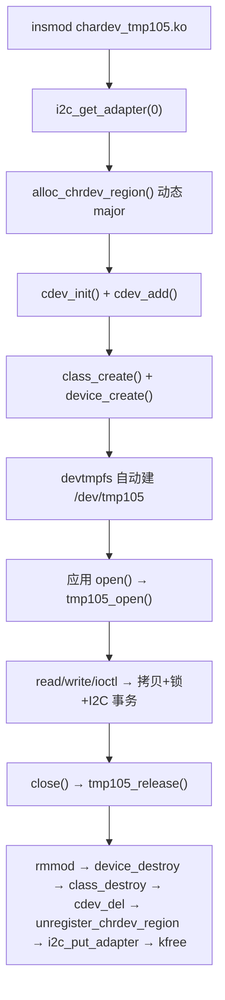

# chardev_tmp105 设计文档（字符驱动标准结构学习）

> 目标：**把"一个标准字符设备驱动"需要哪些东西完整走一遍**，作为以后写其它字符/杂项设备驱动的模板。
> 代码：[`drivers/i2c/chardev_tmp105/chardev_tmp105.c`](../../../drivers/i2c/chardev_tmp105/chardev_tmp105.c) ·
> 头文件（用户态 ABI）：[`chardev_tmp105.h`](../../../drivers/i2c/chardev_tmp105/chardev_tmp105.h) ·
> 手动命令：[手动测试指南](手动测试指南.md) ·
> 一键验收：[`tests/i2c/chardev_tmp105/verify_qemu.sh`](../../../tests/i2c/chardev_tmp105/verify_qemu.sh)

---

## 1. 范围

| 做 | 不做 |
|---|---|
| 字符设备标准骨架：设备号 / `cdev` / `class`+`device` / `file_operations` / ioctl / 模块参数 / 错误回滚 | 不注册 i2c client、不做设备树匹配（那是 [`hwmon_tmp105`](../hwmon_tmp105/设计文档.md) 的事） |
| 与器件交互：用 `i2c_transfer` 发消息读/写 TMP105 寄存器 | 不做 `poll/select`、`mmap`、异步通知（列为 §8 扩展点） |
| 与 hwmon_tmp105 **同时加载**（同一颗芯片两种接口对照） | 不做多实例（写成单实例，改造点见 §8） |

---

## 2. 字符驱动的标准结构（代码里的 ①~⑩）

| # | 要素 | 代码位置 | 关键点 |
|---|---|---|---|
| ① | **模块参数** | [`bus`](../../../drivers/i2c/chardev_tmp105/chardev_tmp105.c:62) / [`addr`](../../../drivers/i2c/chardev_tmp105/chardev_tmp105.c:66) | 环境相关的量（哪条总线、哪个地址）做成参数，别写死 |
| ② | **设备号** | [`alloc_chrdev_region()`](../../../drivers/i2c/chardev_tmp105/chardev_tmp105.c:413) | 动态 major（内核分配，避免撞号）；`unregister_chrdev_region()` 释放 |
| ③ | **`struct cdev`** | [`cdev_add()`](../../../drivers/i2c/chardev_tmp105/chardev_tmp105.c:422) | "设备号 ↔ file_operations"的粘合层；`cdev_init/add/del` 三步 |
| ④ | **class + device** | [`class_create()`](../../../drivers/i2c/chardev_tmp105/chardev_tmp105.c:429) / [`device_create()`](../../../drivers/i2c/chardev_tmp105/chardev_tmp105.c:436) | 有了它 devtmpfs/udev 才会自动建 `/dev/tmp105`；`/sys/class/tmp105/` 也是这时出现的 |
| ⑤ | **file_operations** | [`tmp105_fops`](../../../drivers/i2c/chardev_tmp105/chardev_tmp105.c:378) | `open/release/read/write/unlocked_ioctl/llseek`；`owner` 决定 rmmod 安全性 |
| ⑥ | **`file->private_data`** | [`tmp105_open()`](../../../drivers/i2c/chardev_tmp105/chardev_tmp105.c:223) | 把私有数据挂到 `file` 上，后续回调从它取；多实例时的关键 |
| ⑦ | **内核↔用户态搬数据** | [`read()`](../../../drivers/i2c/chardev_tmp105/chardev_tmp105.c:252) / [`write()`](../../../drivers/i2c/chardev_tmp105/chardev_tmp105.c:283) | `copy_to_user()/copy_from_user()`；检查返回值；尊重 `*ppos`/`count` |
| ⑧ | **私有 ioctl** | [`tmp105_ioctl()`](../../../drivers/i2c/chardev_tmp105/chardev_tmp105.c:316) | `_IOR/_IOW` 命令号 + `get_user()/put_user()`；先校验 magic/命令号 |
| ⑨ | **并发保护** | `mutex` | 锁只保护"访问器件"这一段，别把 `copy_to_user()` 也锁进去 |
| ⑩ | **init/exit 与回滚** | [`tmp105_init()`](../../../drivers/i2c/chardev_tmp105/chardev_tmp105.c:392) / [`tmp105_exit()`](../../../drivers/i2c/chardev_tmp105/chardev_tmp105.c:470) | 注册顺序固定：适配器→设备号→cdev→class→device；失败按相反顺序释放 |

### 2.1 生命周期



### 2.2 与 hwmon_tmp105 的对照（同一颗芯片，两种暴露方式）

| | `chardev_tmp105`（本驱动） | `hwmon_tmp105` |
|---|---|---|
| 注册进 | **字符设备层**（`cdev`） | **hwmon 子系统** |
| 设备发现 | 模块参数 `bus/addr`（模块加载时） | 设备树 `compatible = "ti,tmp105"`（自动 probe） |
| 对外接口 | `/dev/tmp105`（read/write/ioctl） | `/sys/class/hwmon/hwmonN/temp1_*` |
| 用户态代价 | 要自己写 ioctl/解析文本 | 直接 `cat`，任何标准工具都认 |
| 谁来管生命周期 | `module_init/exit` 手工写 | i2c client 的 `probe/remove` |
| I2C 访问 | `i2c_transfer`（手写消息） | `i2c_smbus_*`（SMBus 封装） |
| 是否占用 0x48 | **不占**（只持有 adapter 引用） | 占用（i2c client） |
| 能同时加载吗 | ✅ 能（本设计的刻意选择，便于对照学习） | ✅ 能 |

---

## 3. `/dev/tmp105` 的 ABI

单位统一 **m°C**（25000 = 25.000 °C，-6250 = -6.250 °C）。

### 3.1 `read()` / `write()`

| 操作 | 语义 | 实测 |
|---|---|---|
| `cat /dev/tmp105` | 返回当前温度**十进制文本** + `\n`（例 `25000\n`） | `25000` |
| `echo 20000 > /dev/tmp105` | 写一个整数（m°C）作为上限阈值 T_HIGH | 成功；写 `abc` 报 `Invalid argument`（EINVAL） |

> 用文本是为了 `cat`/`echo` 就能验证；`read()` 里用 `copy_to_user()` 并尊重 `*ppos`，
> 所以是"正常的分片读取"语义（`.llseek = default_llseek`）。

### 3.2 `ioctl()` 命令表

定义在 [`chardev_tmp105.h`](../../../drivers/i2c/chardev_tmp105/chardev_tmp105.h:23)（驱动与用户态**共用**，用户态测试程序即 [`ioctl_test.c`](../../../tests/i2c/chardev_tmp105/ioctl_test.c:1)）：

| 命令 | 方向 | 参数 | 说明 |
|---|---|---|---|
| `TMP105_IOC_GET_TEMP` | 读 | `int *`（m°C） | 当前温度 |
| `TMP105_IOC_GET_TMAX` | 读 | `int *` | 上限阈值 T_HIGH |
| `TMP105_IOC_SET_TMAX` | 写 | `int` | 写上限阈值（0.5 °C 量化、量程钳位） |
| `TMP105_IOC_GET_TMIN` | 读 | `int *` | 下限阈值 T_LOW |
| `TMP105_IOC_SET_TMIN` | 写 | `int` | 写下限阈值 |
| `TMP105_IOC_GET_ALARM` | 读 | `int *` (0/1) | 软件比较 `temp >= T_HIGH` |

> **命令号是 ABI**：`magic`、序号、方向、参数类型一旦发布就不能改（改了就破坏老程序）。
> 这也是为什么头文件里写"定义只写一份，驱动与用户态共用"。

### 3.3 错误码约定（实测）

| 场景 | 返回 | errno |
|---|---|---|
| 未知命令 / magic 不对 | `-ENOTTY` | `ENOTTY`（25, "Inappropriate ioctl"） |
| ioctl 传 `NULL` 指针 | `-EFAULT` | `EFAULT`（14） |
| `write("abc")` / 内容不是整数 | `-EINVAL` | `EINVAL`（22） |
| I2C 从机不应答（器件不在） | `-EREMOTEIO` | `EREMOTEIO` |

---

## 4. 关键代码走读

### 4.1 注册与回收（⑩）

```c
/* 顺序：适配器 → 设备号 → cdev → class → device；失败按相反顺序回滚 */
d->adapter = i2c_get_adapter(bus);          /* 拿总线控制器引用（必须 put） */
alloc_chrdev_region(&d->devt, 0, 1, ...);   /* 动态 major */
cdev_init(&d->cdev, &tmp105_fops);
cdev_add(&d->cdev, d->devt, 1);
d->class = class_create(THIS_MODULE, DEVICE_NAME);
d->dev = device_create(d->class, NULL, d->devt, d, DEVICE_NAME);
```
对应代码：[`tmp105_init()`](../../../drivers/i2c/chardev_tmp105/chardev_tmp105.c:392)。

### 4.2 `read()`：三件事

1. 从器件取温度（内部加锁的 I2C 事务）；
2. 格式化到内核缓冲（`scnprintf`）；
3. `copy_to_user()` 搬到用户态，并更新 `*ppos`、返回"实际字节数"。

见 [`tmp105_read()`](../../../drivers/i2c/chardev_tmp105/chardev_tmp105.c:252)。

### 4.3 `ioctl()`：先校验，再按方向取放

```c
if (_IOC_TYPE(cmd) != TMP105_IOC_MAGIC) return -ENOTTY;
if (_IOC_NR(cmd) > TMP105_IOC_MAXNR)   return -ENOTTY;
switch (cmd) { case TMP105_IOC_GET_TEMP: ... put_user(...) ... }
```
见 [`tmp105_ioctl()`](../../../drivers/i2c/chardev_tmp105/chardev_tmp105.c:316)。

### 4.4 `fops.owner` 与 rmmod 安全

`owner = THIS_MODULE` → `open()` 时内核给模块加引用，`release()` 时减引用。
因此**文件还开着时 `rmmod` 返回 `-EBUSY`**，不会把正在执行的代码卸掉。

---

## 5. 踩过的坑（都已在代码/文档里修掉）

| 坑 | 现象 | 处理 |
|---|---|---|
| **返回值二义性** | 温度是负值时，`read()` 把 `-6250` 当错误码返回，`cat` 报 `Invalid argument` | 统一 `int *out` 出参：`ret < 0` 才是错误（[`tmp105_read_temp_mc()`](../../../drivers/i2c/chardev_tmp105/chardev_tmp105.c:163)） |
| 9p 挂载不保证可执行 | 直接 `/mnt/.../ioctl_test` 可能跑不起来 | 先 `cp` 到 `/tmp`（tmpfs）再执行（见 [`read_dev.sh`](../../../tests/i2c/chardev_tmp105/read_dev.sh:1)） |
| shell 重定向作用域 | `a; b > file 2>&1` 只把 `b` 的输出写进文件 | 用 `( a; b ) > file 2>&1` 包起来（`verify_qemu.sh` 的 `guest_out()`） |
| devtmpfs 缺失时没有节点 | `/dev/tmp105` 不存在 | 从 `/proc/devices` 取 major，`mknod /dev/tmp105 c <major> 0` |
| `const` 位置 | `file_operations` 应声明为 `static const` | 否则 checkpatch 告警 |

---

## 6. 与内核自带 `misc` 方式的取舍

简单字符设备常直接写成 **miscdevice**（`misc_register()`）：不用自己分配设备号、不用 `class_create`，
内核给一个统一的 major 10 和 `/dev/<name>`。学习标准结构时先走 `cdev` 路线（本驱动），
理解"设备号/cdev/class"三件套之后，`misc` 就是它的"打包版"。

---

## 7. 验收

```sh
# 一键（宿主）：编译驱动 + 编译用户态测试程序 + 起 QEMU + 18 项断言
tests/i2c/chardev_tmp105/verify_qemu.sh

# 客户机内自检（只用 /dev/tmp105 接口）
sh /mnt/tests/i2c/chardev_tmp105/read_dev.sh
```

实测结果：`checkpatch 0 errors / 0 warnings`；端到端 **PASS=18 FAIL=0**（含与 `hwmon_tmp105` 共存）。

---

## 8. 扩展点（下一步可以练）

| 想练 | 怎么做 |
|---|---|
| `miscdevice` | 用 `misc_register()` 重写一版，对比省掉了哪些步骤 |
| 多实例 | 每个 i2c 地址一个 `tmp105_char`，`cdev_add` 多次；`file->private_data` 指向各自实例 |
| 阻塞/非阻塞 | 加 `poll()` + 等待队列；`open()` 时看 `O_NONBLOCK` |
| 异步通知 | `fasync` + `kill_fasync()` |
| 结构化 ioctl | 传结构体（`copy_from_user` + `_IOC_SIZE` 校验），替代标量 |
| sysfs 属性 | `DEVICE_ATTR_RO()` 暴露阈值/报警（对比 hwmon 的标准接口） |
| `compat_ioctl` | 32 位应用跑在 64 位内核上时用（arm64 上要注意 ABI 对齐） |
| 设备树匹配 | 改成 i2c client 驱动 + `of_device_id`（那就是 hwmon_tmp105 那条路） |
